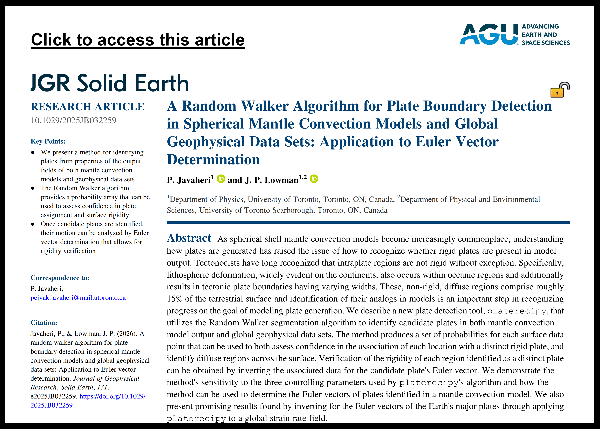

# Welcome to `platerecipy`: a package for PLATE RECognition in PYthon!

## Features

* Reliable surface tesselation and **candidate plate detection**
* Generates a **probability field** for the assessment of plate detection output
* Requires **no specific grid or structure** for the input data
* Utilizes `numpy` arrays for the ease of use and integration in `Python` projects
* Straight-forward save and export to `Octave/MATLAB` and `ParaView` 
* Designed for maximized compatibility with **terrestrial data sets** and **geodynamic model output**

## How it works
For a detailed explanation and illustration of `platerecipy`'s core functionalities,
please refer to:
> Javaheri, P., & Lowman, J. P. (2026). A random walker algorithm for plate boundary detection in spherical mantle convection models and global geophysical data sets: Application to Euler vector determination. _Journal of Geophysical Research: Solid Earth_, 131, e2025JB032259. https://doi.org/10.1029/2025JB032259

