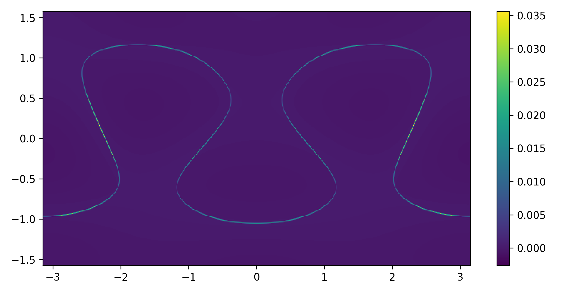
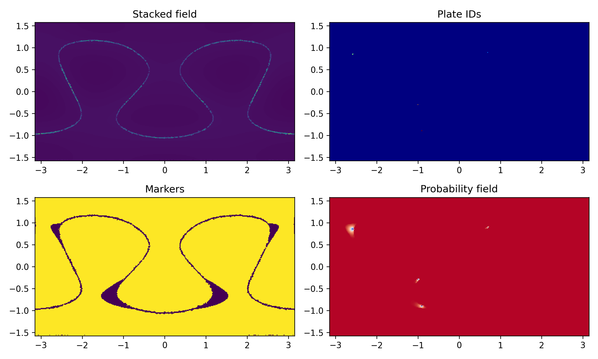
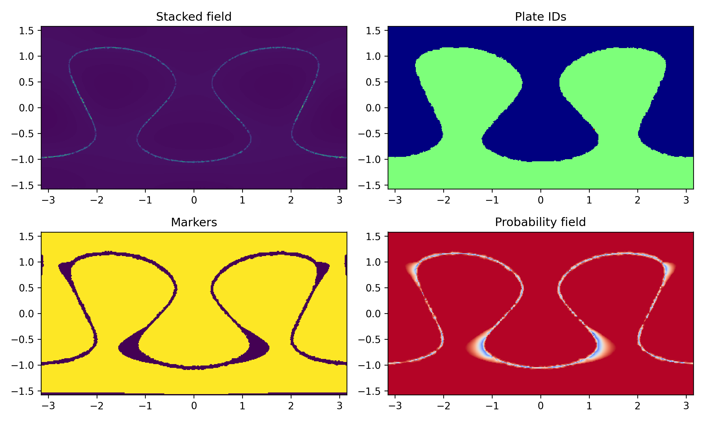
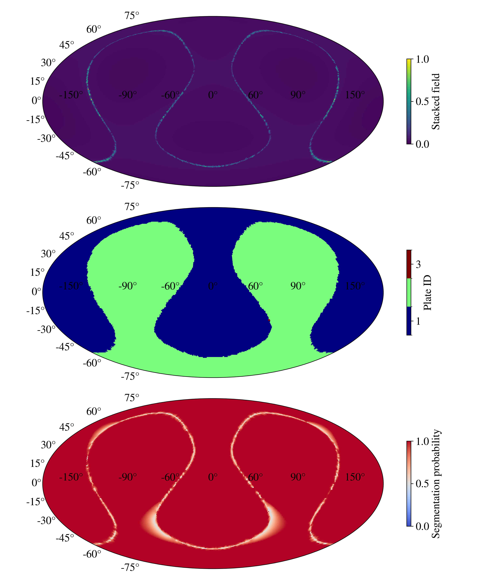
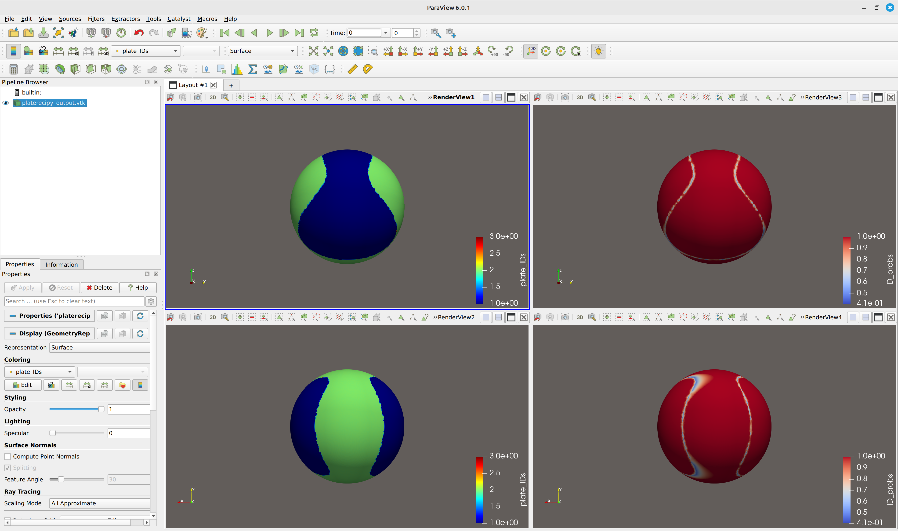
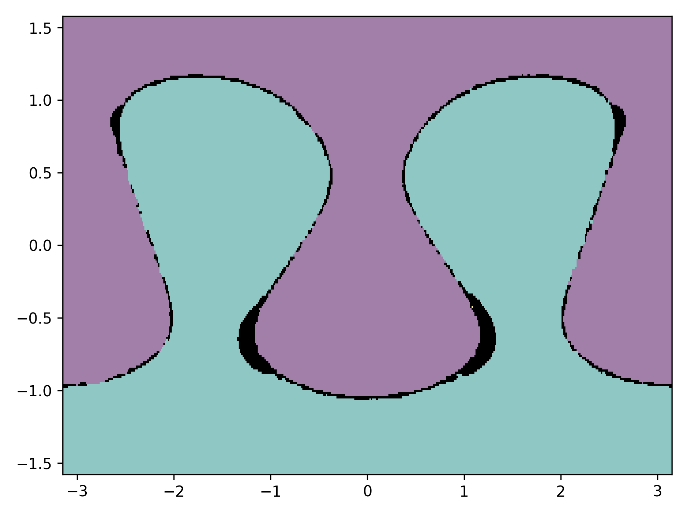
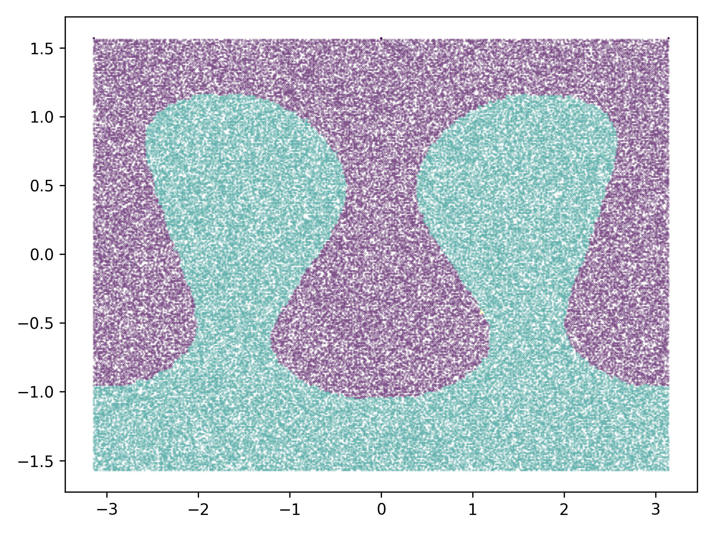

# Detailed example

## A randomly generated input from spherical harmonics

To illustrate `platerecipy`'s functionalities on a reproducible input, let's work 
with an input field generated by a pseudorandom sum of spherical harmonics:

```python
import numpy as np

def generate_sample_input(lrange=(1, 4), rng_seed=111, npoints=100_000):
    from scipy.special import sph_harm_y
    from scipy.ndimage import laplace

    thetas, phis = np.meshgrid(
        np.linspace(0, np.pi, 300),
        np.linspace(-np.pi, np.pi, 600),
        indexing='ij'
    )
    rng = np.random.default_rng(rng_seed)
    F = 0
    for l in range(lrange[0], lrange[1]):
        for m in range(-l, l+1):
            F += (rng.uniform()-0.25) * sph_harm_y(l, m, thetas, phis).real
    F = laplace(np.abs(F))
    rand_data = rng.choice(thetas.size, size=npoints, replace=False)
    data_phis = phis.ravel()[rand_data]
    data_thetas = thetas.ravel()[rand_data]
    data_F = F.ravel()[rand_data]
    data_xs = np.sin(data_thetas)*np.cos(data_phis)
    data_ys = np.sin(data_thetas)*np.sin(data_phis)
    data_zs = np.cos(data_thetas)
    return data_xs, data_ys, data_zs, data_F
```



`generate_sample_input` function now will generate an ungridded set of 100,000 points that 
are randomly sampled from the surface of a sphere with unit radius. We store the 
data points as:
```python
data_xs, data_ys, data_zs, data_F = generate_sample_input()
```
where `data_xs`, `data_ys`, and `data_zs` are the Cartesian coordinates of each 
point with field value `data_F`. Up to this point, we've merely generated a set 
of points with no inherent structure.

Now, let's use `platerecipy`'s `SphericalGrid` object to generate a grid and 
interpolate field values:

```python
from platerecipy.grid import SphericalGrid

# initializing a grid base on input coordinates
grid = SphericalGrid(data_xs, data_ys, data_zs)

# interpolating the input data
field1 = grid.interpolate_field(data_F)
```

!!! warning "Coordinate compatibility"
    For optimization purposes, `grid.interpolate_field()` can only accept an input
    argument (`data_F`) that has coordinates identical to what used to initialize 
    the `grid` object.


Now, we can define a `PlateModel` object on our `SphericalGrid`:
```python
from platerecipy.model import PlateModel

# initializing a plate model
model = PlateModel(grid)

# stacking our interpolated field
model.stack_field(field1)

# additional fields can be stacked here
```

Finally, we can use our `model` to find plates by specifying our plate detection 
parameters of choice:
```python
model.find_plates(
    boundary_quantile   = 0.95, 
    RW_beta             = 100.0,
)
```

!!! warning "Field stacking"
    Once the `find_plates()` method is called, no more fields can be stacked.

Now, the following 2D arrays are accessible via the `model` object:
```python
model.stacked_field     # the normalized [0, 1] stacked field
model.markers           # segmentation markers as a diagnostic tool
model.plate_IDs         # plate IDs
model.ID_probs          # the probability field
```
These arrays retain the shape and coordinates of the `grid` object. This is 
important as one can easy use the `grid` object to retrieve:
```python
grid.xs                 # Cartesian x-coordinate
grid.ys                 # Cartesian y-coordinate
grid.zs                 # Cartesian z-coordinate
grid.thetas             # Spherical colatiude [0, pi]
grid.phis               # Spherical azimuth [-pi, pi]
grid.r                  # Radius of the sphere
```

We can plot our arrays using `matplotlib`:
```python
import matplotlib.pyplot as plt

fig, axes = plt.subplots(2, 2, figsize=(10, 6))

ax = axes[0][0]
ax.set_title("Stacked field")
ax.pcolormesh(grid.phis, np.pi/2 - grid.thetas, model.stacked_field)

ax = axes[1][0]
ax.set_title("Markers")
ax.pcolormesh(grid.phis, np.pi/2 - grid.thetas, model.markers)

ax = axes[0][1]
ax.set_title("Plate IDs")
ax.pcolormesh(grid.phis, np.pi/2 - grid.thetas, model.plate_IDs, cmap="jet")

ax = axes[1][1]
ax.set_title("Probability field")
ax.pcolormesh(grid.phis, np.pi/2 - grid.thetas, model.ID_probs, cmap="coolwarm")

fig.tight_layout()
```


Looking at the plotted panels, we can see that seemingly no plates were detected.
This could be due to two main reasons:

1. `boundary_quantile` was set at too high of a value

2. Noisy input or missing boundary segments

This is why taking a look at `model.markers` (bottom left panel) is informative 
as a diagnostic tool: it is clear that boundaries are well reflected on `model.markers`
which suggests the issue is not `boundary_quantile`. Rather, it is the noisy input 
that has resulted in micro discontinuities along the boundary path. To remedy 
this, we invoke `separation_tolerance` and set it at 1 degree:
```python
model.find_plates(
    boundary_quantile    = 0.95, 
    separation_tolerance = 1*np.pi/180,     # in radians
    RW_beta              = 100.0,
)
```
now we can replot our fields:


or we can simply use `platerecipy`'s built-in io functions:
```python
from platerecipy.io import save_mollweide_projection, save_as_vtk

# generating ParaView readable legacy .vtk
save_as_vtk(model)

# generating .png Mollweide projection 
save_mollweide_projection(model)
```






We can see that by introducing some separation tolerance, we were able to recover 
the main candidate plates. The following subsection discusses the red micro marker (`plate_ID == 3`)
located roughly near 70 degrees east and 30 degrees south. 

!!! note "`platerecipy.io.save_as_vtk` vs. `platerecipy.io.save_as_vtp`"
    Both of these functions generate ParaView readable output.  However, `save_as_vtk`
    does not require third party packages of `vtk` and `pyvista`. Accordingly, 
    by default `save_as_vtk` is preferred.

??? tip "Complete script (click)"
    ```python
    import numpy as np

    def generate_sample_input(lrange=(1, 4), rng_seed=111, npoints=100_000):
        from scipy.special import sph_harm_y
        from scipy.ndimage import laplace

        thetas, phis = np.meshgrid(
            np.linspace(0, np.pi, 300),
            np.linspace(-np.pi, np.pi, 600),
            indexing='ij'
        )
        rng = np.random.default_rng(rng_seed)
        F = 0
        for l in range(lrange[0], lrange[1]):
            for m in range(-l, l+1):
                F += (rng.uniform()-0.25) * sph_harm_y(l, m, thetas, phis).real
        F = laplace(np.abs(F))
        rand_data = rng.choice(thetas.size, size=npoints, replace=False)
        data_phis = phis.ravel()[rand_data]
        data_thetas = thetas.ravel()[rand_data]
        data_F = F.ravel()[rand_data]
        data_xs = np.sin(data_thetas)*np.cos(data_phis)
        data_ys = np.sin(data_thetas)*np.sin(data_phis)
        data_zs = np.cos(data_thetas)
        return data_xs, data_ys, data_zs, data_F


    data_xs, data_ys, data_zs, data_F = generate_sample_input()


    from platerecipy.grid import SphericalGrid

    # initializing a grid base on input coordinates
    grid = SphericalGrid(data_xs, data_ys, data_zs)

    # interpolating the input data
    field1 = grid.interpolate_field(data_F)

    from platerecipy.model import PlateModel

    # initializing a plate model
    model = PlateModel(grid)

    # stacking our interpolated field
    model.stack_field(field1)

    # additional fields can be stacked here

    model.find_plates(
        boundary_quantile    = 0.95, 
        separation_tolerance = 1*np.pi/180.,
        RW_beta              = 100.0,
    )


    import matplotlib.pyplot as plt

    fig, axes = plt.subplots(2, 2, figsize=(10, 6))

    ax = axes[0][0]
    ax.set_title("Stacked field")
    ax.pcolormesh(grid.phis, np.pi/2 - grid.thetas, model.stacked_field)

    ax = axes[1][0]
    ax.set_title("Markers")
    ax.pcolormesh(grid.phis, np.pi/2 - grid.thetas, model.markers)

    ax = axes[0][1]
    ax.set_title("Plate IDs")
    ax.pcolormesh(grid.phis, np.pi/2 - grid.thetas, model.plate_IDs, cmap="jet")

    ax = axes[1][1]
    ax.set_title("Probability field")
    ax.pcolormesh(grid.phis, np.pi/2 - grid.thetas, model.ID_probs, cmap="coolwarm")

    fig.tight_layout()
    fig.savefig("field_plots.png", dpi=300)

    from platerecipy.io import save_mollweide_projection, save_as_vtk

    # generating ParaView readable legacy .vtk
    save_as_vtk(model)

    # generating .png Mollweide projection 
    save_mollweide_projection(model)
    ```

## Micro markers and noise
In noisy or low resolution input, it is possible to end up with a very small set of 
nodes clump together and generate fictitious micro markers. Our example above 
illustrates this problem: at the boundary of plates 1 and 2, there are a few 
nodes near 70 degrees east and 30 degrees south that gave rise to a distinct (micro)
marker that resulted in those nodes getting assigned plate ID 3. 

In these scenarios, it is useful to invoke `min_marker_size` argument to filter 
markers comprised of fewer than a given number of points. 

## Low-confidence and non-conforming regions
Having access to the probability field in addition to the stacked field allows 
us to identify low-confidence and/or diffuse regions which we will refer to them 
here as non-conforming regions.

`numpy` array indexing allows for an easy and straight forward way of identifying 
such regions. In our example with two plates, we can search for regions with 
an ID assignment probability of less than 80 percent:

```python
# plotting the plate IDs
plt.pcolormesh(grid.phis, np.pi/2-grid.thetas, model.plate_IDs, alpha=0.5)

# plotting low-confidence regions in black shading
temp = model.ID_probs.copy()
temp[(model.ID_probs > 0.8)] = float('NaN')
plt.pcolormesh(grid.phis, np.pi/2-grid.thetas, temp, cmap='Grays', vmin=-1, vmax=0)
```


## Mapping to original ungridded input data points
We can map any field of our choice back to the input by calling:

```python
org_IDs = grid.map_to_original_input(model.plate_IDs)
```

and plotting the data points:

```python
plt.scatter(grid.original_phis, np.pi/2 - grid.original_thetas, c=org_IDs, marker='.', s=0.1)
```




